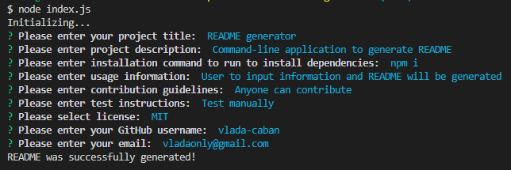

# README generator 
  

  ## Description 

  Command-line application to generate professional README based on user input. 

  ---

  ## Table of Contents

- [Installation](#installation)
- [Usage](#usage)
- [Questions](#questions)
- [License](#license)

## Installation

To install necessary dependencies, run the following command:

```npm i```

## Usage

Used for generating README for any project based on user input.



Link to the walkthrough video: [follow the link](https://drive.google.com/file/d/16xtVbNYhkFr4D2Ta0VsOJeXT4qS4isHi/view?usp=sharing)

Example of generated README: [link inside the repo](./generatedREADME/README.md)

## Questions
GitHub profile: [vlada-caban](https://github.com/vlada-caban)

## License 
  License: MIT